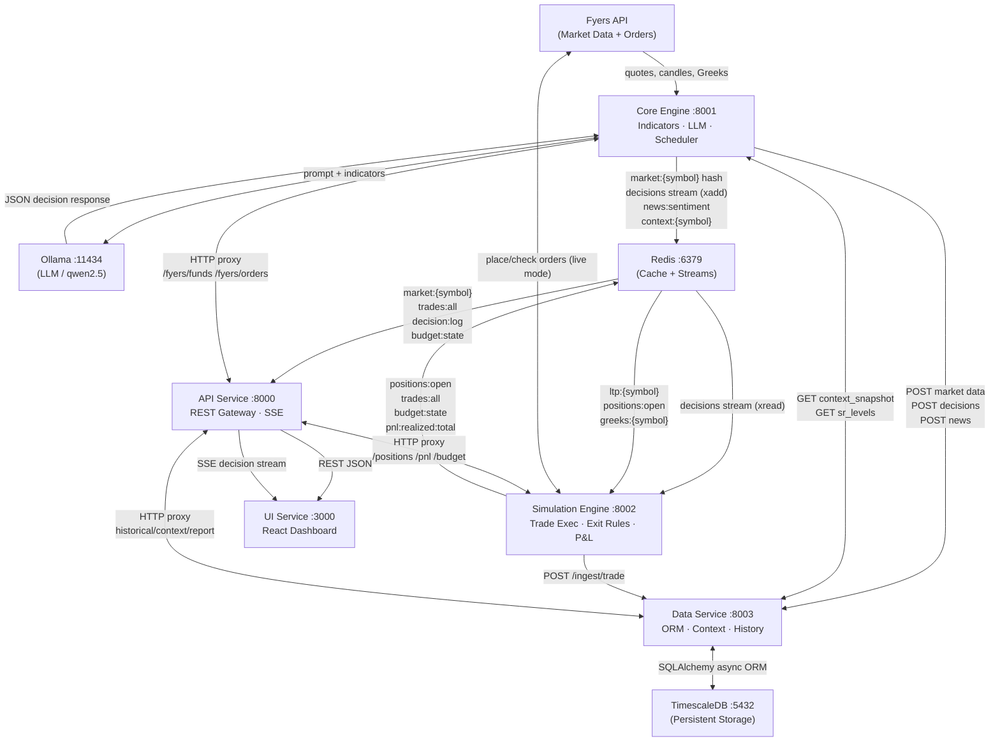
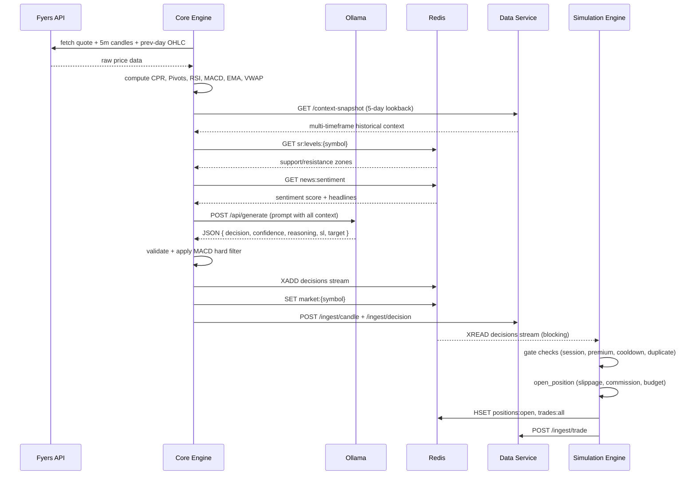
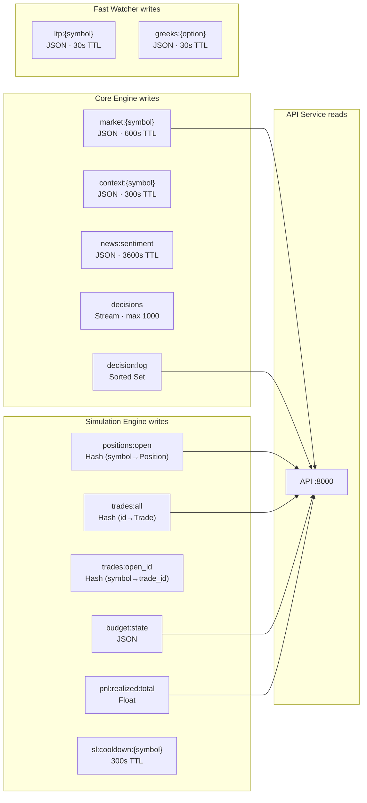
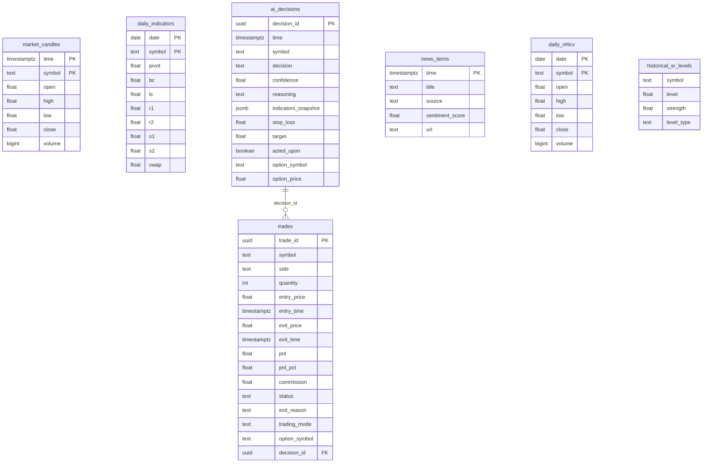

# System Architecture

## Service Interaction Overview

```mermaid
graph TD
    FYERS["Fyers API\n(Market Data + Orders)"]
    OLLAMA["Ollama :11434\n(LLM / qwen2.5)"]
    REDIS["Redis :6379\n(Cache + Streams)"]
    TSDB["TimescaleDB :5432\n(Persistent Storage)"]

    CORE["Core Engine :8001\nIndicators · LLM · Scheduler"]
    SIM["Simulation Engine :8002\nTrade Exec · Exit Rules · P&L"]
    DATA["Data Service :8003\nORM · Context · History"]
    API["API Service :8000\nREST Gateway · SSE"]
    UI["UI Service :3000\nReact Dashboard"]

    FYERS -->|"quotes, candles, Greeks"| CORE
    CORE -->|"POST market data\nPOST decisions\nPOST news"| DATA
    CORE -->|"market:{symbol} hash\ndecisions stream (xadd)\nnews:sentiment\ncontext:{symbol}"| REDIS
    CORE <-->|"GET context_snapshot\nGET sr_levels"| DATA
    OLLAMA -->|"JSON decision response"| CORE
    CORE -->|"prompt + indicators"| OLLAMA

    REDIS -->|"decisions stream (xread)"| SIM
    REDIS -->|"ltp:{symbol}\npositions:open\ngreeks:{symbol}"| SIM
    SIM -->|"positions:open\ntrades:all\nbudget:state\npnl:realized:total"| REDIS
    SIM -->|"POST /ingest/trade"| DATA
    FYERS <-->|"place/check orders (live mode)"| SIM

    DATA <-->|"SQLAlchemy async ORM"| TSDB

    REDIS -->|"market:{symbol}\ntrades:all\ndecision:log\nbudget:state"| API
    API <-->|"HTTP proxy\n/positions /pnl /budget"| SIM
    API <-->|"HTTP proxy\n/fyers/funds /fyers/orders"| CORE
    API <-->|"HTTP proxy\nhistorical/context/report"| DATA

    API -->|"REST JSON"| UI
    API -->|"SSE decision stream"| UI
```

## Data Flow: Market Scan Cycle (every 5 min)

```mermaid
sequenceDiagram
    participant F as Fyers API
    participant C as Core Engine
    participant O as Ollama
    participant R as Redis
    participant D as Data Service
    participant S as Simulation Engine

    C->>F: fetch quote + 5m candles + prev-day OHLC
    F-->>C: raw price data
    C->>C: compute CPR, Pivots, RSI, MACD, EMA, VWAP
    C->>D: GET /context-snapshot (5-day lookback)
    D-->>C: multi-timeframe historical context
    C->>R: GET sr:levels:{symbol}
    R-->>C: support/resistance zones
    C->>R: GET news:sentiment
    R-->>C: sentiment score + headlines
    C->>O: POST /api/generate (prompt with all context)
    O-->>C: JSON { decision, confidence, reasoning, sl, target }
    C->>C: validate + apply MACD hard filter
    C->>R: XADD decisions stream
    C->>R: SET market:{symbol}
    C->>D: POST /ingest/candle + /ingest/decision
    R-->>S: XREAD decisions stream (blocking)
    S->>S: gate checks (session, premium, cooldown, duplicate)
    S->>S: open_position (slippage, commission, budget)
    S->>R: HSET positions:open, trades:all
    S->>D: POST /ingest/trade
```

## Redis Key Space

```mermaid
graph LR
    subgraph "Core Engine writes"
        MKT["market:{symbol}\nJSON · 600s TTL"]
        CTX["context:{symbol}\nJSON · 300s TTL"]
        NS["news:sentiment\nJSON · 3600s TTL"]
        DST["decisions\nStream · max 1000"]
        DL["decision:log\nSorted Set"]
    end

    subgraph "Simulation Engine writes"
        POS["positions:open\nHash (symbol→Position)"]
        TRD["trades:all\nHash (id→Trade)"]
        OID["trades:open_id\nHash (symbol→trade_id)"]
        BST["budget:state\nJSON"]
        PNL["pnl:realized:total\nFloat"]
        SLC["sl:cooldown:{symbol}\n300s TTL"]
    end

    subgraph "Fast Watcher writes"
        LTP["ltp:{symbol}\nJSON · 30s TTL"]
        GRK["greeks:{option}\nJSON · 30s TTL"]
    end

    subgraph "API Service reads"
        MKT --> API_R["API :8000"]
        TRD --> API_R
        DL --> API_R
        POS --> API_R
        BST --> API_R
        PNL --> API_R
    end
```

## Database Schema (TimescaleDB)

```mermaid
erDiagram
    market_candles {
        timestamptz time PK
        text symbol PK
        float open
        float high
        float low
        float close
        bigint volume
    }
    daily_indicators {
        date date PK
        text symbol PK
        float pivot
        float bc
        float tc
        float r1
        float r2
        float s1
        float s2
        float vwap
    }
    ai_decisions {
        uuid decision_id PK
        timestamptz time
        text symbol
        text decision
        float confidence
        text reasoning
        jsonb indicators_snapshot
        float stop_loss
        float target
        boolean acted_upon
        text option_symbol
        float option_price
    }
    trades {
        uuid trade_id PK
        text symbol
        text side
        int quantity
        float entry_price
        timestamptz entry_time
        float exit_price
        timestamptz exit_time
        float pnl
        float pnl_pct
        float commission
        text status
        text exit_reason
        text trading_mode
        text option_symbol
        uuid decision_id FK
    }
    news_items {
        timestamptz time PK
        text title
        text source
        float sentiment_score
        text url
    }
    daily_ohlcv {
        date date PK
        text symbol PK
        float open
        float high
        float low
        float close
        bigint volume
    }
    historical_sr_levels {
        text symbol
        float level
        float strength
        text level_type
    }

    ai_decisions ||--o{ trades : "decision_id"
```
