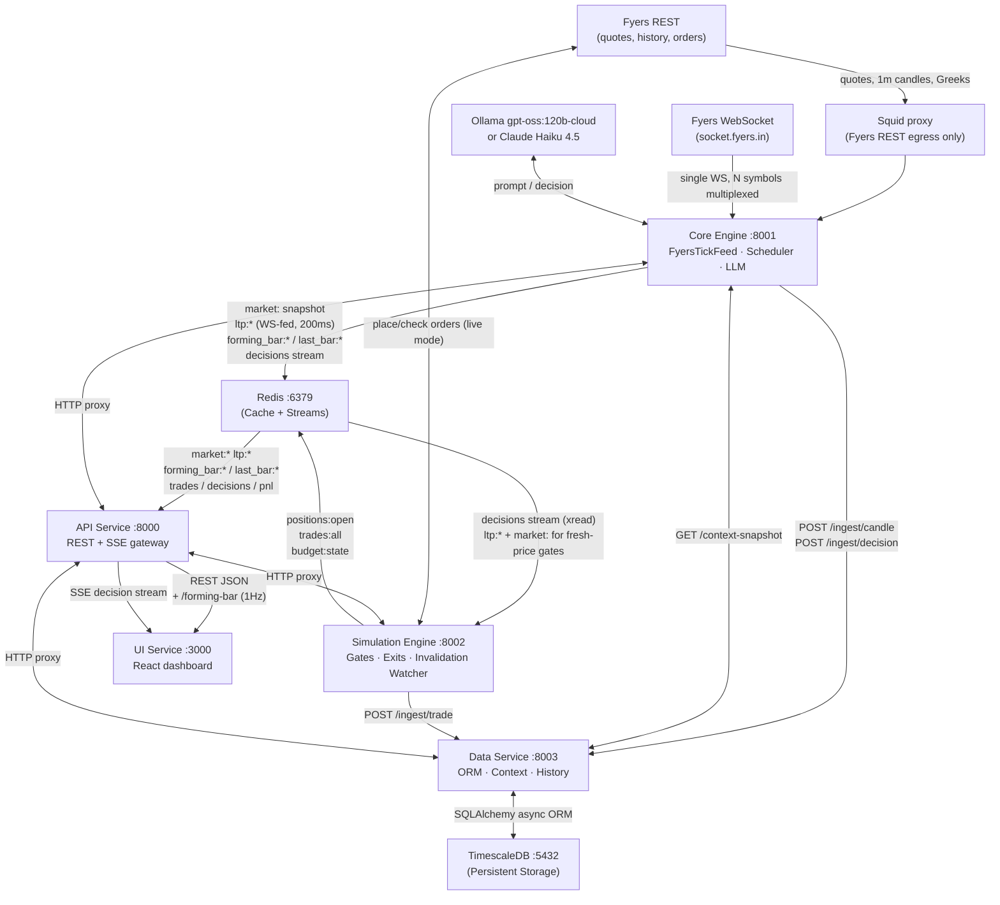
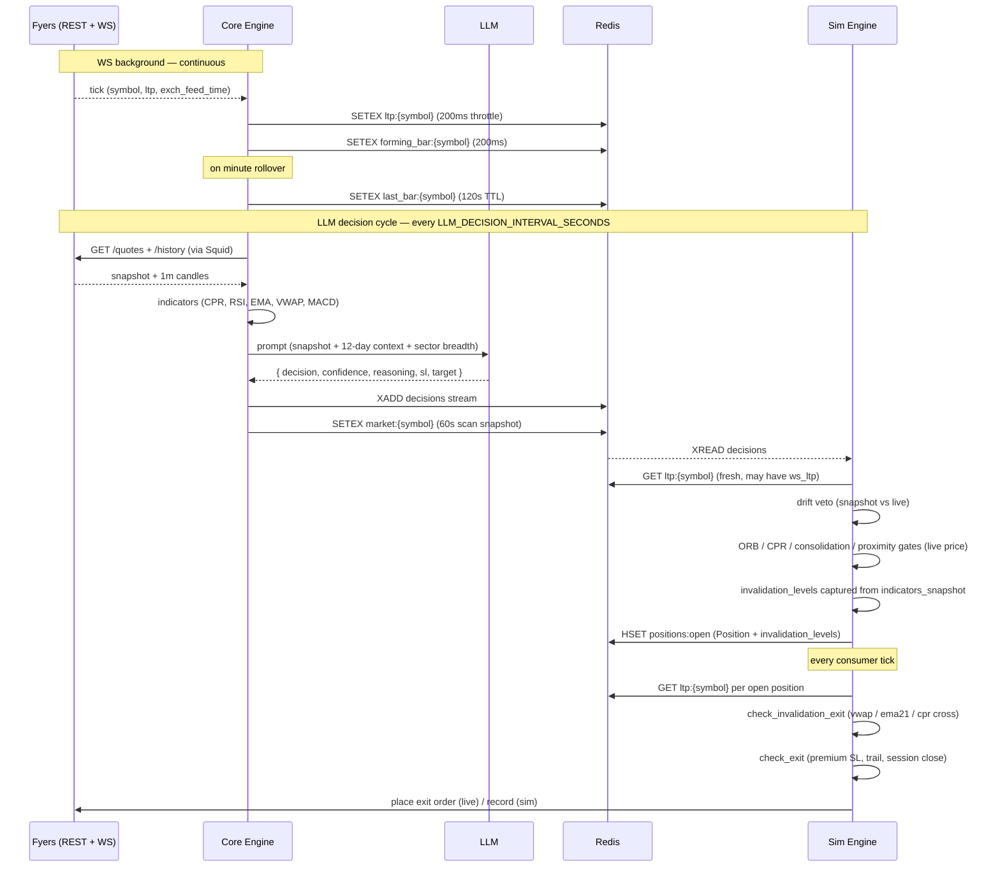
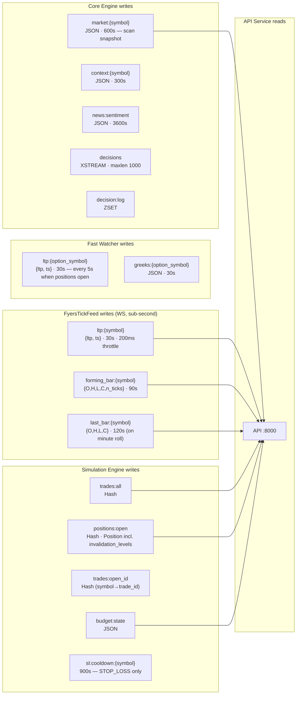
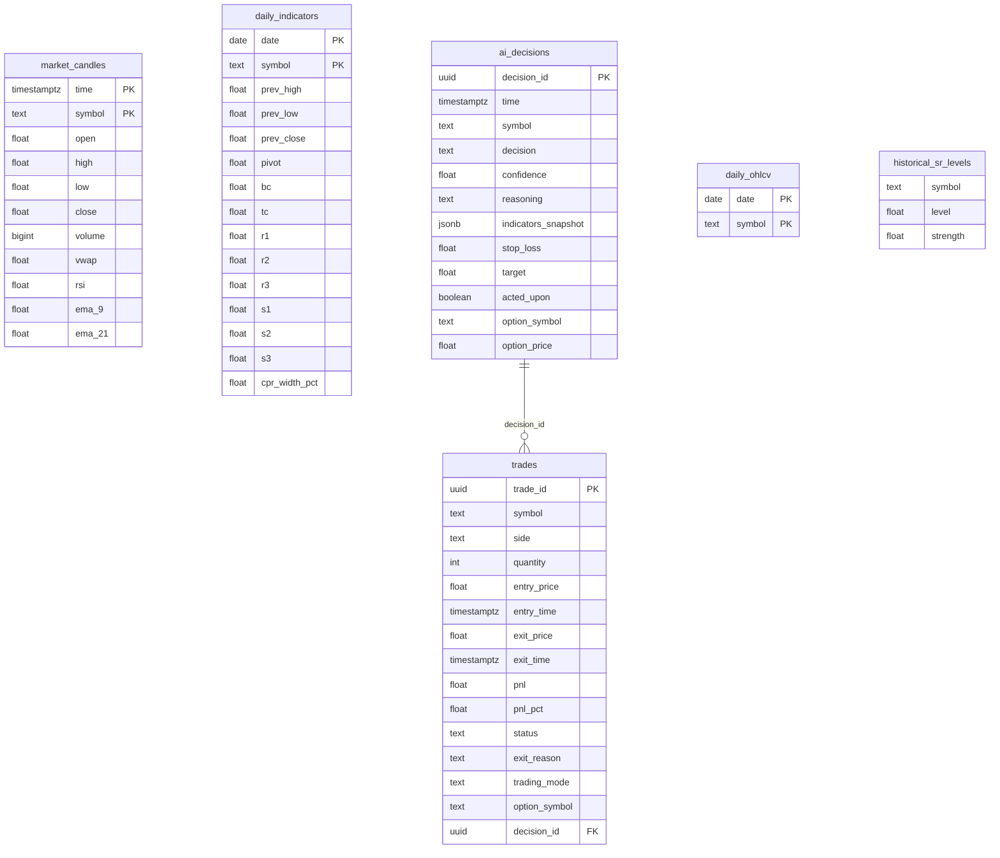

# System Architecture

## Service Interaction Overview



**Network topology note.** REST traffic to Fyers goes through Squid (the proxy IP is on Fyers' whitelist). The WebSocket goes **direct to Cloudflare** — Fyers' WS endpoint isn't IP-whitelisted, and the SDK's `WebSocketApp.run_forever` path doesn't pass proxy params anyway. Verified end-to-end 2026-05-14 via `tests/fyers_sdk_ws_path_check.py` and Squid access logs.

## Data Flow: Decision → Trade



## Three-Layer Entry Pipeline (simulation-engine consumer)

```
LLM decision
   │
   ├─ Confidence floor (≥ 0.70)
   ├─ Late-session cutoff — block new entries within 15 min of session_close
   ├─ Fresh-price refresh — fetch live ltp and use it for the downstream gates
   │                       (gates evaluate against the actual market, not the
   │                        scan-time snapshot which may be tens of seconds stale)
   ├─ ORB gate    — price must clear 09:15–09:30 range by ORB_BUFFER
   │                (gate is disabled for the rest of the session once price
   │                 has crossed either threshold today — backtest shows
   │                 ~75% of break-days have material follow-through)
   ├─ CPR gate    — block when price is inside the [BC × 0.998, TC × 1.002]
   │                no-trade bracket; outside, direction-agnostic (CPR is a
   │                level, not a breakout barrier)
   ├─ Consolidation gate — block when inside a tight consolidation AND
   │                       (no breakout OR breakout direction conflicts with signal)
   ├─ Entry proximity   — block if next level is within PA_PROXIMITY
   ├─ Pre-entry exit sim — run check_exit on a hypothetical position with
   │                       a 0.5% favorable tick; if any exit/trail would
   │                       fire on tick 1, refuse the entry (catches
   │                       entry-vs-exit gate definition inconsistencies)
   └─ open_position  (captures invalidation_levels from snapshot)
```

## Three-Layer Exit Pipeline (per consumer tick)

```
For each open position:
   │
   ├─ check_invalidation_exit  (cheap; runs first)
   │     SELL → exit if price > vwap / ema_21 / cpr_tc
   │     BUY  → exit if price < vwap / ema_21 / cpr_bc
   │
   └─ check_exit  (the heavier rule chain)
         ├─ session close (15:20 hard exit)
         ├─ premium stop loss (−10% on option)
         ├─ milestone trail (locks profit after +20% / +10% on day_type)
         └─ option-LTP unavailable → skip cycle (don't fall back to underlying)
```

## Redis Key Space



**Overlay rule on `/market-data`**: the endpoint reads `market:{symbol}` for the full snapshot, then if `ltp:{symbol}` has `ts` ≤ 30s old, replaces `ltp` with the WS value and adds `ltp_source: "ws"`. Fail-open: any error returns the unaltered snapshot.

## Forming-Bar Pipeline (chart consolidation at 1 Hz)

```
WS tick (exch_feed_time)             SDK thread
   │  bar_min = (exch_feed_time // 60) * 60
   ▼
self._forming_bars[symbol]  =  {bar_min, O, H, L, C, n}
   │  (on minute rollover: previous → self._finalized_bars[symbol])
   ▼
async consumer (200ms throttle per symbol)         event loop
   │  SETEX forming_bar:{symbol}  (90s TTL)
   │  SETEX last_bar:{symbol}     (120s TTL on rollover)
   ▼
GET /api/v1/market-data/forming-bar
   │  returns { forming_bar, last_bar }
   ▼
ui-service useEffect (1 Hz, every timeframe)
   │  1m  : splice forming bar as its own candle
   │  ≥5m : update LAST aggregated candle's close, extend H/L
   ▼
React state setter returns the original array when nothing changed → no re-render
```

The 200ms backend throttle and 1s UI poll are deliberately decoupled. Backend stays fast so the **drift veto** and **invalidation exits** see fresh prices; UI is consolidated to 1Hz so the chart never flickers tick-by-tick.

## Database Schema (TimescaleDB)



**Bar-persistence note.** The scheduler's filter for which 1m bars to upsert into `market_candles` uses `c.timestamp >= last_ts` (not strict `>`) so a bar that was persisted while partial gets one more upsert when Fyers finalises it. Without this, the DB held point-snapshots with 10-20pt phantom gaps between consecutive bars. Helper lives in `core-engine/scheduler/candle_filter.py` with unit tests in `tests/core/test_candle_persistence_filter.py`. The WS tick feed never writes to TimescaleDB — only Redis.

## Diagnostic / fixture assets

- `tests/fyers_sdk_ws_path_check.py` — proves which network path the SDK uses (REST → Squid, WS → direct).
- `tests/ws_proxy_smoketest.py` — validates Squid CONNECT to wss://socket.fyers.in works.
- `tests/ws_rest_shadow_compare.py` — runs inside trading-core during market hours, compares WS-fed `ltp:*` against a parallel REST `/quotes` for parity + latency.
- `tests/fixtures/ws_capture_2026-05-15/` — 5 min of live WS frames, reference API responses, and an offline analyser. Used to validate the forming-bar / tick-driven-exit design without needing market hours.
