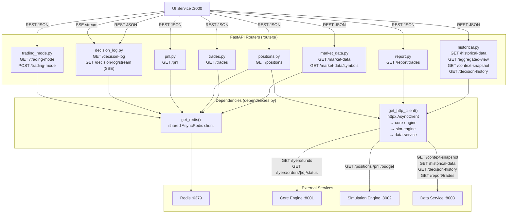
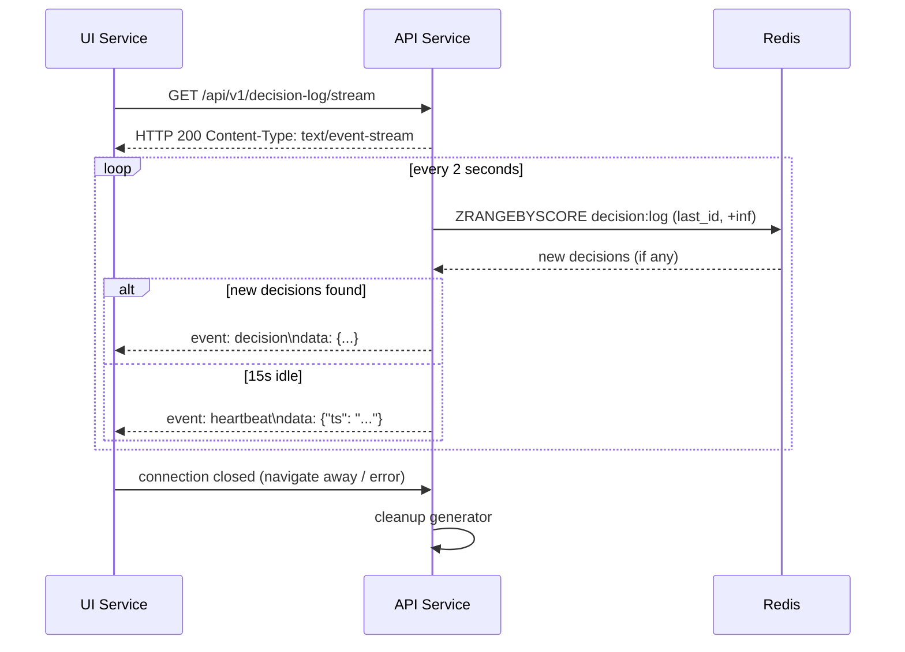
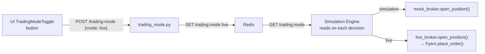

# API Service — Architecture

The API service is the single entry point for the UI. It acts as a gateway — reading from Redis for real-time state, proxying historical and report queries to the data service, and streaming live decisions to the UI via SSE.

## Component Map

## Request Flow per Endpoint

```mermaid
flowchart TD
    subgraph "GET /market-data"
        MD1["HGETALL market:*\nfrom Redis"] --> MD2["Return all symbol snapshots\n(ltp, change, indicators, candles)"]
    end

    subgraph "GET /positions"
        P1["HGETALL positions:open\nfrom Redis"] --> P2["Enrich each position\nwith current LTP"]
        P2 --> P3["Return positions[]\nwith unrealized P&L"]
    end

    subgraph "GET /trades"
        T1["ZREVRANGE trades:history\nfrom Redis (sorted set)"] --> T2["Filter by symbol / limit"]
        T2 --> T3["Return trades[]"]
    end

    subgraph "GET /pnl"
        PL1["GET pnl:realized:total from Redis"] --> PL2["GET budget:state from Redis"]
        PL2 --> PL3["Compute win_rate, avg_win, avg_loss\nfrom trades:history"]
        PL3 --> PL4["Build P&L timeline\nfrom pnl:daily:{date}"]
        PL4 --> PL5["Return PnLResponse"]
    end

    subgraph "GET /decision-log"
        DL1["ZREVRANGEBYSCORE decision:log\nfrom Redis"] --> DL2["Decode JSON\nApply symbol / decision filters"]
        DL2 --> DL3["Return decisions[] + total"]
    end

    subgraph "SSE /decision-log/stream"
        SSE1["Open SSE connection"] --> SSE2["Poll decision:log\nevery 2s (ZRANGEBYSCORE\nby last_id)"]
        SSE2 -->|"new entry"| SSE3["Emit 'decision' event"]
        SSE2 -->|"15s idle"| SSE4["Emit 'heartbeat' event"]
        SSE3 & SSE4 --> SSE2
    end

    subgraph "GET /historical-data or /aggregated-view"
        H1["HTTP proxy → Data Service\n/historical-data or /aggregated-view"] --> H2["Return candles[]"]
    end

    subgraph "GET /report/trades"
        R1["HTTP proxy → Data Service\n/report/trades?month=YYYY-MM"] --> R2["Return summary + breakdown + trades[]"]
    end
```

## SSE Decision Stream Detail

## Trading Mode Toggle

