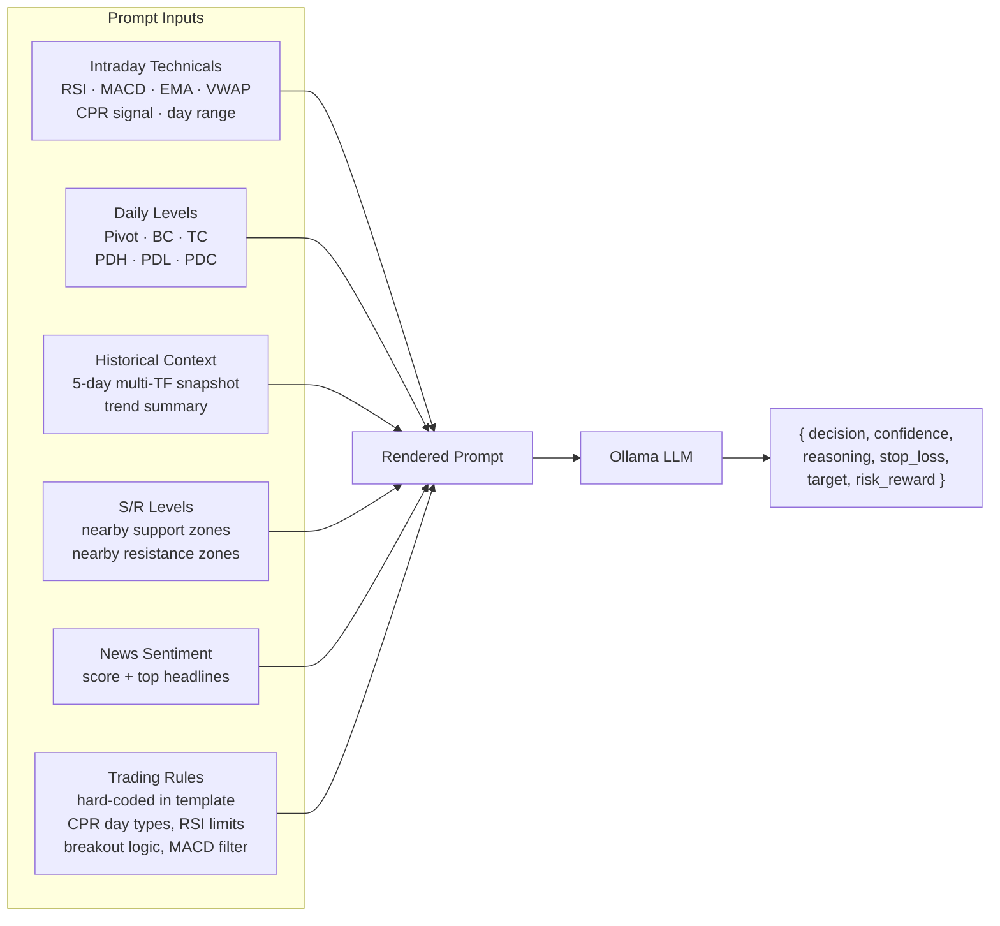

# Core Engine — Architecture

The core engine is the brain of the system. It ingests live market data from Fyers, computes technical indicators, queries an LLM to produce trading decisions, and publishes them to Redis for the simulation engine to act on.

## Component Map

```mermaid
graph TD
    subgraph "Entry Points"
        LIFE["main.py\nlifespan hook"]
        SCHED["scheduler/jobs.py\nAPScheduler"]
    end

    subgraph "Fyers Integration (fyers/)"
        AUTH["auth.py\nOAuth token refresh"]
        QUOTE["market_data.py\nquotes, candles, prev-day OHLC"]
        OPT["options.py\nATM strike resolution\nlot size lookup"]
        GREEK["greeks.py\ndelta, IV, vega, theta"]
        ORD["orders.py\nplace order, poll fill status"]
    end

    subgraph "Indicators (indicators/)"
        CPR["cpr.py\nCPR (BC, TC, Pivot)\nCamarilla levels"]
        PIVOT["pivot_levels.py\nR1/R2/R3, S1/S2/S3"]
        RSI["rsi.py\nRSI(14)"]
        MACD["macd.py\nMACD line/signal/histogram"]
        EMA["ema.py\nEMA(9), EMA(21)"]
        VWAP["vwap.py\nVWAP from intraday candles"]
        CON["consolidation.py\nrange %, breakout detection"]
        SR["historical_sr.py\nswing-point clustering\nstrength scoring"]
    end

    subgraph "LLM Layer (llm/)"
        PROMPT["prompts.py\nDecisionPromptTemplate\nrules injection"]
        DEC["decision.py\nmake_decision()\n_parse_llm_response()\n_validate_decision()"]
        OLLAMA["Ollama :11434\n(external)"]
    end

    subgraph "News Layer (news/)"
        SCRAPE["scraper.py\nweb scraping"]
        SENT["sentiment.py\nTextBlob / transformers"]
    end

    subgraph "Context Layer (context/)"
        CTX["builder.py\nbuild_context_snapshot()\n5-day multi-TF lookback"]
    end

    subgraph "External I/O"
        REDIS["Redis\n(publish)"]
        FYERS_API["Fyers API"]
        DATASVC["Data Service :8003"]
    end

    LIFE --> SCHED
    SCHED -->|"every 5min"| SCAN["market_scan job"]
    SCHED -->|"every 10s"| WATCH["fast_position_watcher job"]
    SCHED -->|"every 15min"| NEWS["news_refresh job"]
    SCHED -->|"every 5min"| CTX_JOB["context_refresh job"]
    SCHED -->|"Sunday 08:00"| SR_JOB["sr_levels_weekly job"]

    SCAN --> QUOTE
    SCAN --> AUTH
    QUOTE --> FYERS_API
    SCAN --> CPR
    SCAN --> PIVOT
    SCAN --> RSI
    SCAN --> MACD
    SCAN --> EMA
    SCAN --> VWAP
    SCAN --> CON

    SCAN --> CTX
    CTX --> DATASVC
    SCAN --> PROMPT
    PROMPT --> DEC
    DEC --> OLLAMA
    OLLAMA -->|"JSON response"| DEC
    DEC --> OPT
    OPT --> FYERS_API

    SCAN -->|"XADD decisions\nSET market:{symbol}"| REDIS
    SCAN --> DATASVC

    WATCH --> QUOTE
    WATCH --> GREEK
    WATCH -->|"SET ltp:{symbol}\nSET greeks:{option}"| REDIS

    NEWS --> SCRAPE
    SCRAPE --> SENT
    NEWS -->|"SET news:sentiment"| REDIS
    NEWS --> DATASVC

    CTX_JOB --> CTX
    CTX_JOB -->|"SET context:{symbol}"| REDIS

    SR_JOB --> SR
    SR_JOB --> DATASVC
    SR_JOB -->|"SET sr:levels:{symbol}"| REDIS
```



## Decision-Making Flow

```mermaid
flowchart TD
    START([market_scan triggered]) --> FETCH[Fetch quote + 5m candles\n+ prev-day OHLC from Fyers]
    FETCH --> INDICATORS[Compute CPR · Pivots · RSI\nMACD · EMA · VWAP · Range]
    INDICATORS --> CONTEXT[GET context_snapshot\nfrom Data Service]
    CONTEXT --> SR[GET sr:levels from Redis]
    SR --> NEWS_S[GET news:sentiment from Redis]
    NEWS_S --> PROMPT_BUILD[Build LLM Prompt\nInject: indicators, context,\nS/R zones, sentiment, rules]

    PROMPT_BUILD --> LLM_CALL[POST Ollama /api/generate]
    LLM_CALL --> PARSE{Parse JSON response}
    PARSE -->|valid JSON| VALIDATE[Validate decision]
    PARSE -->|parse error| REGEX[Regex fallback extraction]
    REGEX --> VALIDATE

    VALIDATE --> CONF{confidence < 0.5?}
    CONF -->|yes| FORCE_HOLD[Force HOLD]
    CONF -->|no| MACD_CHECK{MACD hard filter}

    MACD_CHECK -->|"BUY + BEARISH MACD"| REDUCE_CONF[Reduce confidence −0.15]
    MACD_CHECK -->|"SELL + BULLISH MACD"| REDUCE_CONF
    MACD_CHECK -->|aligned| OPTION_RES[Resolve ATM option contract]
    REDUCE_CONF --> CONF

    OPTION_RES --> SL_SANITIZE[Sanitize SL / Target\n ensure correct side of price]
    SL_SANITIZE --> PUBLISH[XADD decisions stream\nSET market:{symbol}\nPersist to data-service]

    FORCE_HOLD --> PUBLISH_HOLD[Publish HOLD decision\nPersist to data-service]
```

## APScheduler Job Timeline

```mermaid
gantt
    title Core Engine Scheduled Jobs (market hours only)
    dateFormat HH:mm
    axisFormat %H:%M

    section Market Scan
    market_scan (every 5min) :active, 09:15, 15:30

    section Position Watcher
    fast_position_watcher (every 10s) :active, 09:15, 15:30

    section News
    news_refresh (every 15min) :active, 09:00, 16:00

    section Context
    context_refresh (every 5min) :active, 09:00, 16:00

    section S/R Levels
    sr_levels_weekly (Sunday 08:00) :milestone, 08:00, 1m
```



## LLM Prompt Structure


