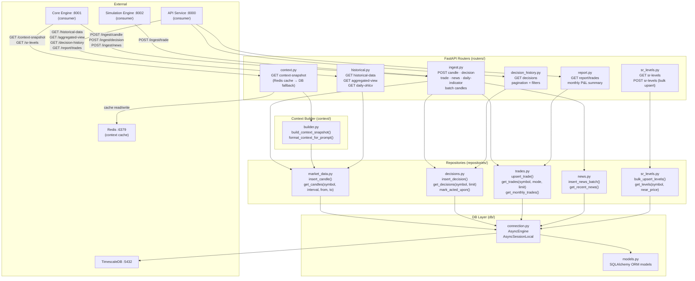
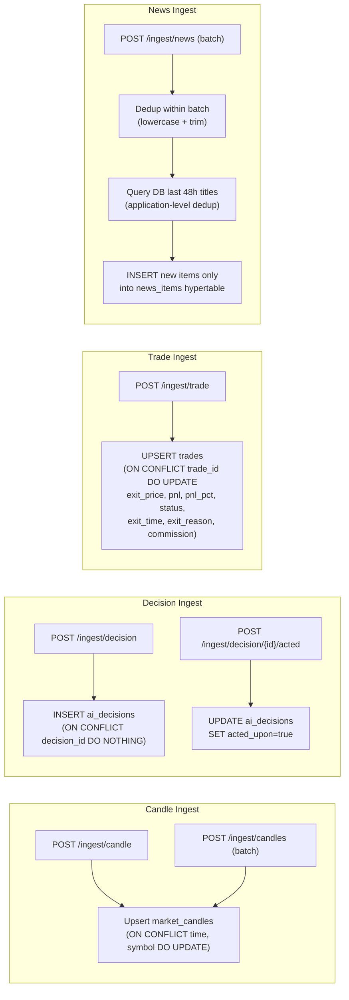
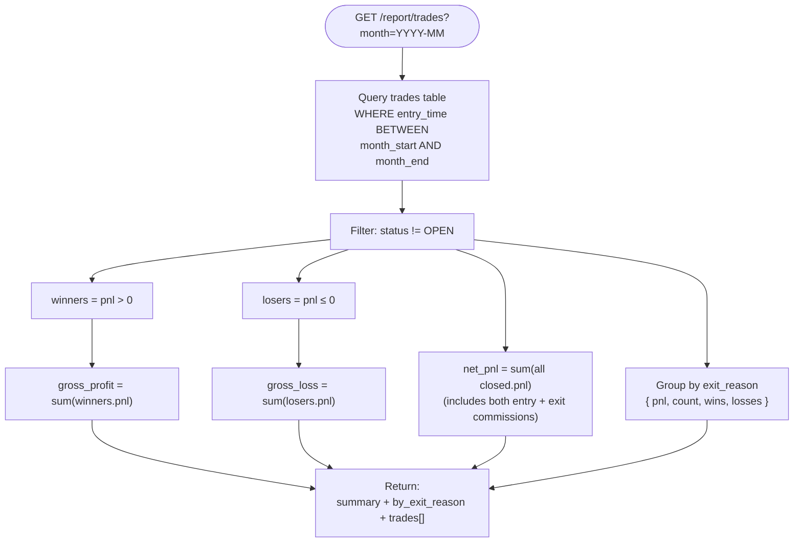
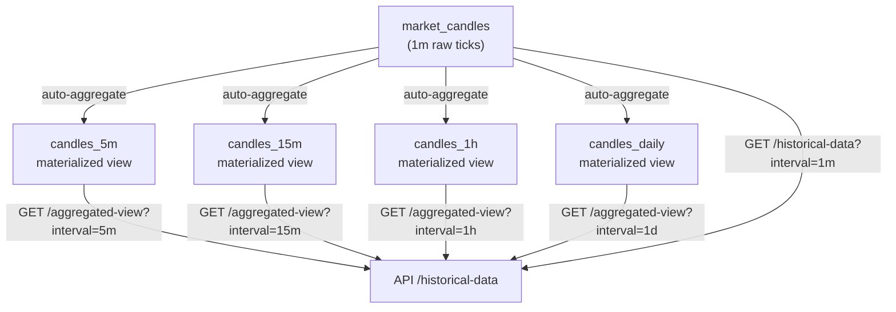

# Data Service — Architecture

The data service is the persistence layer. It owns all TimescaleDB reads and writes, builds historical context snapshots for the LLM, serves aggregated candle views, and generates monthly reports.

## Component Map



## Context Snapshot Build Flow

```mermaid
flowchart TD
    REQ(["GET /context-snapshot?symbol=X"]) --> CACHE{Redis cache hit?\ncontext:{symbol} · 5min TTL}
    CACHE -->|hit| RETURN_CACHE([Return cached JSON])
    CACHE -->|miss| QUERY[Query market_candles\nlast 5 trading days]

    QUERY --> AGG_5M["Aggregate 1m → 5m candles\n(OHLCV grouping)"]
    AGG_5M --> AGG_15M["Aggregate → 15m candles"]
    AGG_15M --> AGG_1H["Aggregate → 1h candles"]
    AGG_1H --> AGG_D["Aggregate → daily candles"]

    AGG_D --> INDICATORS["Compute per-timeframe\nRSI · MACD · EMA · trend direction"]
    INDICATORS --> FORMAT["Format structured context\nfor LLM prompt injection"]
    FORMAT -->|"SET context:{symbol}\n300s TTL"| REDIS_D["Redis"]
    FORMAT --> RETURN([Return context JSON])
```

## Ingest Pipeline



## Monthly Report Generation



## TimescaleDB Continuous Aggregates


