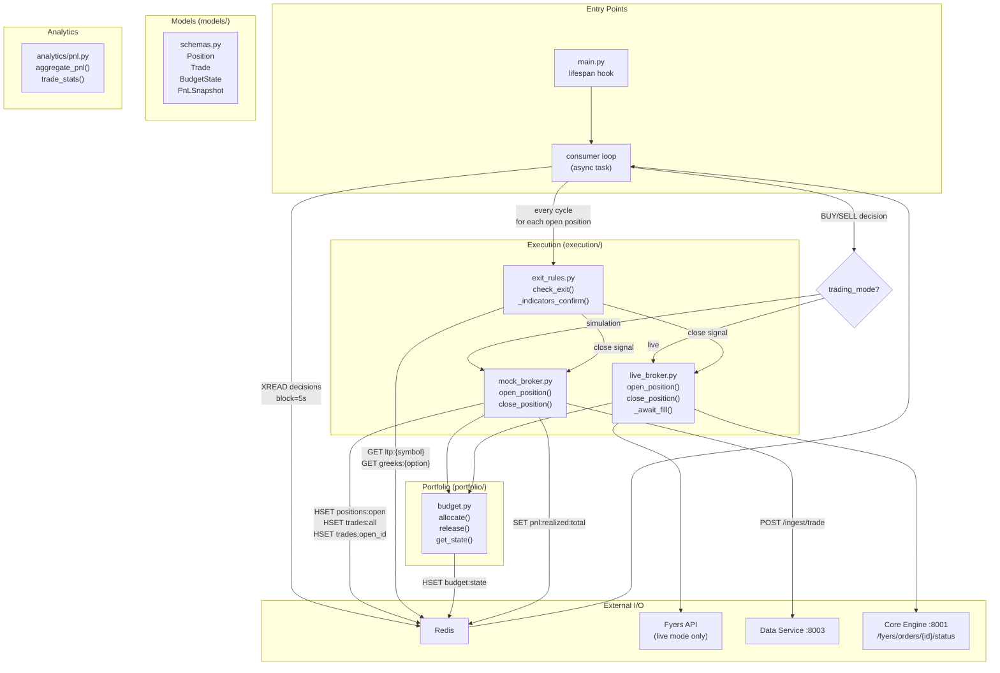
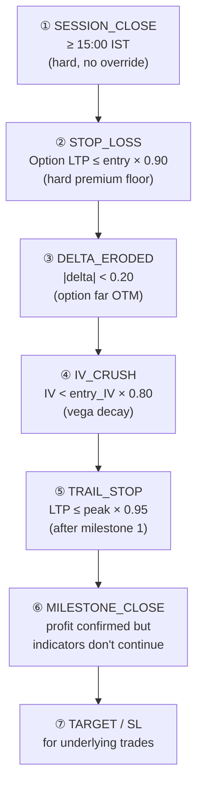
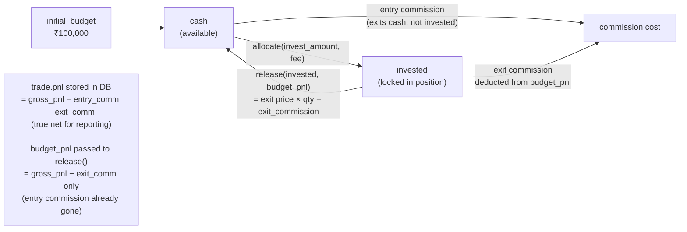
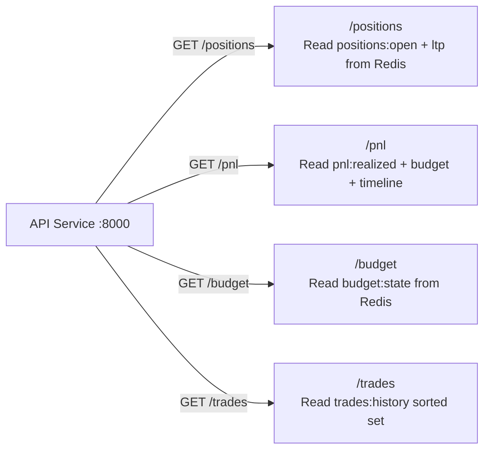

# Simulation Engine — Architecture

The simulation engine consumes decisions from the Redis stream, manages virtual (or live) trade execution, enforces exit rules on every position watcher cycle, and tracks P&L via the budget system.

## Component Map



## Trade Lifecycle

```mermaid
flowchart TD
    DECISION(["Decision arrives\n(BUY/SELL from stream)"]) --> G1{Session close check\n≥ 15:15 IST?}
    G1 -->|yes| SKIP1([Skip — session ending])
    G1 -->|no| G2{Min option premium\n≥ ₹30?}
    G2 -->|no| SKIP2([Skip — premium too low])
    G2 -->|yes| G3{SL cooldown active\nfor symbol?}
    G3 -->|yes| SKIP3([Skip — cooling down\nafter stop loss])
    G3 -->|no| G4{Open position already\nexists for symbol?}
    G4 -->|yes| SKIP4([Skip — no double position])
    G4 -->|no| OPEN[open_position()]

    OPEN --> SLIP[Apply slippage\n±0.05% of price]
    SLIP --> COMM[Calculate commission\nmax₹20 flat · 0.03% of value]
    COMM --> ALLOC{Budget allocation\nsufficient?}
    ALLOC -->|no| SKIP5([Skip — insufficient budget])
    ALLOC -->|yes| PERSIST[Persist Position + Trade\nto Redis + TimescaleDB]
    PERSIST --> ACTIVE(["Position OPEN\nmonitored every 10s"])

    ACTIVE --> EXIT_CHECK[check_exit() called]

    EXIT_CHECK --> SC{Rule 1\nSession close\n≥ 15:00 IST?}
    SC -->|yes| CLOSE_SC([Close: SESSION_CLOSE])

    SC -->|no| SL{Rule 2\nOption LTP ≤\nentry × 0.90?}
    SL -->|yes| CLOSE_SL([Close: STOP_LOSS\n+ set 5min cooldown])

    SL -->|no| DELTA{Rule 3\n|delta| < 0.20?}
    DELTA -->|yes| CLOSE_DE([Close: DELTA_ERODED])

    DELTA -->|no| IV{Rule 4\nIV < entry_IV × 0.80?}
    IV -->|yes| CLOSE_IV([Close: IV_CRUSH])

    IV -->|no| TRAIL{Rule 5\nLTP ≤ peak × 0.95\nAND milestone ≥ 1?}
    TRAIL -->|yes| CLOSE_TS([Close: TRAIL_STOP])

    TRAIL -->|no| MILE{Rule 6\nLTP ≥ entry × milestone_pct?}
    MILE -->|no| ACTIVE
    MILE -->|yes| CONFIRM{2-of-3 indicators confirm?\nRSI · VWAP · MACD}
    CONFIRM -->|yes| ADV[Advance milestone\nUpdate peak price]
    ADV --> ACTIVE
    CONFIRM -->|no| CLOSE_MILE([Close: milestone\ngains locked])
```

## Exit Rule Priority



## Budget Flow



## API Endpoints


