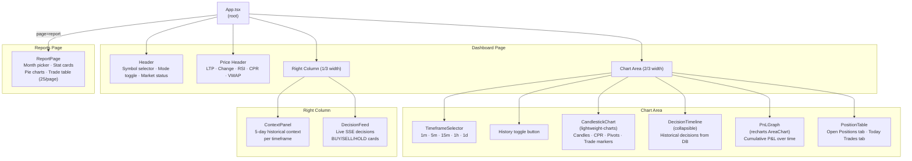
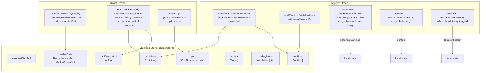
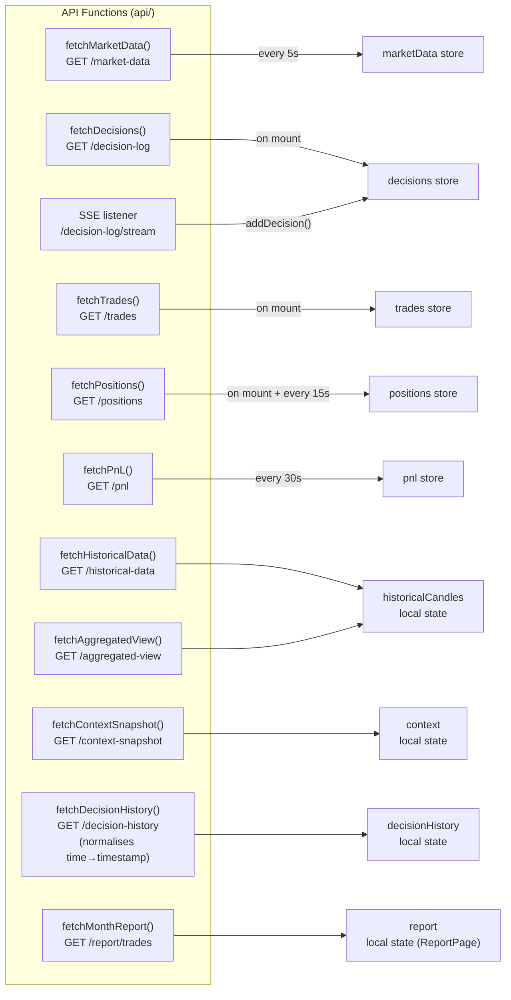
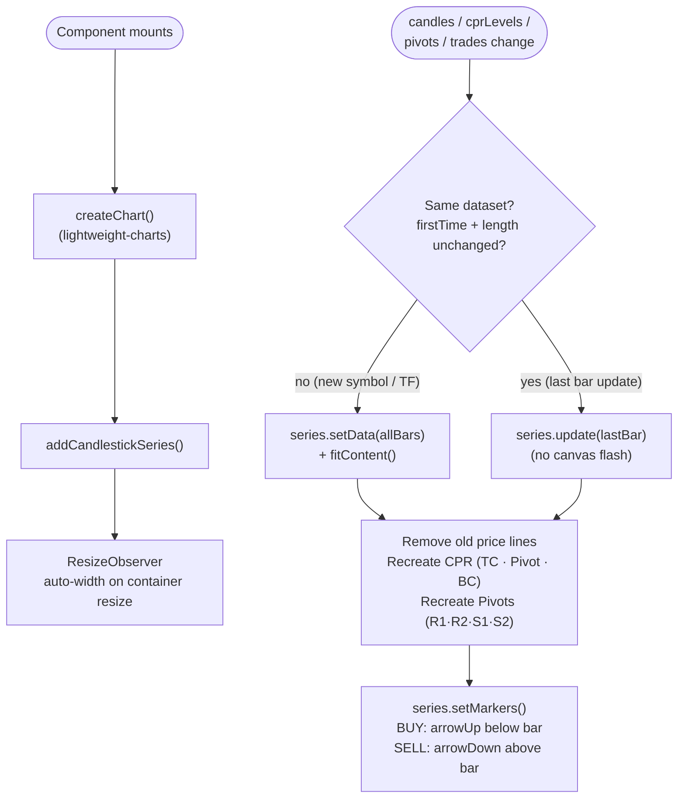
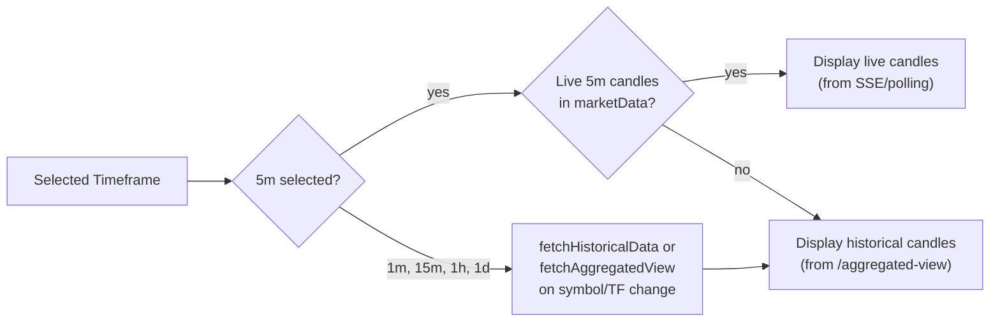
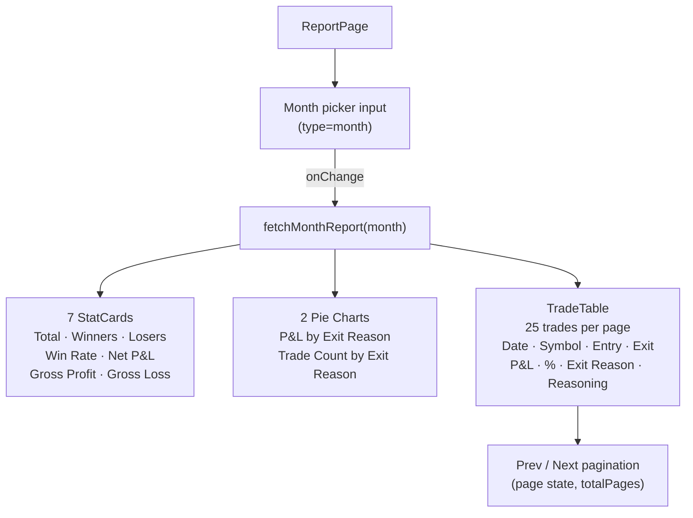

# UI Service — Architecture

The UI is a React + TypeScript SPA. It polls REST endpoints for positions, trades, and P&L, connects to the SSE stream for live decisions, and presents everything in a single-page dashboard with an optional reports view.

## Component Tree

## State Management

## Data Fetching Map

## CandlestickChart Render Logic

## Candle Display Decision

## ReportPage Structure

